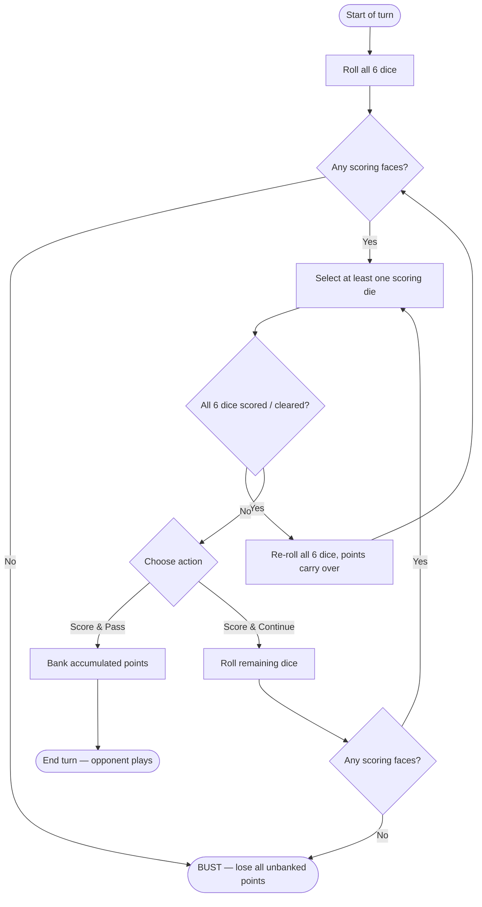

# KCD2 - Dice

## toc
<!-- TOC orderedlist:false updateonsave:true depthto:4 -->

- [KCD2 - Dice](#kcd2---dice)
    - [toc](#toc)
    - [quick-reference](#quick-reference)
        - [flow-chart-rules](#flow-chart-rules)
        - [farkle-scoring](#farkle-scoring)
        - [textual-rules](#textual-rules)
            - [key-rules](#key-rules)
        - [example-turns](#example-turns)
            - [example-1: score-and-pass](#example-1-score-and-pass)
            - [example-2: bust](#example-2-bust)
            - [example-3: clear-and-reroll](#example-3-clear-and-reroll)
    - [my-dice](#my-dice)
        - [optimal-1](#optimal-1)
        - [optimal-2](#optimal-2)
        - [-spam](#-spam)
    - [special-dice](#special-dice)
        - [dice-glossary](#dice-glossary)
            - [Aranka's Die](#arankas-die)
            - [Cautious Cheater's Die](#cautious-cheaters-die)
            - [Ci Die](#ci-die)
            - [Devil's Head Die](#devils-head-die)
            - [Die of Misfortune](#die-of-misfortune)
            - [Even Die](#even-die)
            - [Favourable Die](#favourable-die)
            - [Fer Die](#fer-die)
            - [Greasy Die](#greasy-die)
            - [Grimy Die](#grimy-die)
            - [Grozav's Lucky Die](#grozavs-lucky-die)
            - [Heavenly Kingdom Die](#heavenly-kingdom-die)
            - [Holy Trinity Die](#holy-trinity-die)
            - [Hugo's Die](#hugos-die)
            - [King's Die](#kings-die)
            - [Lousy Gambler's Die](#lousy-gamblers-die)
            - [Lu Die](#lu-die)
            - [Lucky Die](#lucky-die)
            - [Mathematician's Die](#mathematicians-die)
            - [Molar Die](#molar-die)
            - [Monk's Die DLC](#monks-die-dlc)
            - [Mother-of-Pearl Die DLC](#mother-of-pearl-die-dlc)
            - [Odd Die](#odd-die)
            - [Ordinary Die](#ordinary-die)
            - [Painted Die](#painted-die)
            - [Pie Die](#pie-die)
            - [Premolar Die](#premolar-die)
            - [Sad Greaser's Die](#sad-greasers-die)
            - [Saint Antiochus' Die](#saint-antiochus-die)
            - [Shrinking Die](#shrinking-die)
            - [St. Stephen's Die](#st-stephens-die)
            - [Strip Die](#strip-die)
            - [Tengri's Die DLC](#tengris-die-dlc)
            - [Trinity Die](#trinity-die)
            - [Unbalanced Die](#unbalanced-die)
            - [Unlucky Die](#unlucky-die)
            - [Wagoner's Die](#wagoners-die)
            - [Weighted Die](#weighted-die)
            - [Wisdom Tooth Die](#wisdom-tooth-die)
        - [table: detailed-stats](#table-detailed-stats)
    - [admin](#admin)

<!-- /TOC -->

## quick-reference

### flow-chart-rules

[top](#toc)

### farkle-scoring

[top](#toc)

| Combination | Points |
| :--- | :--- |
| Single 1 | 100 |
| Single 5 | 50 |
| Triple 1s | 1,000 |
| Triple 2s | 200 |
| Triple 3s | 300 |
| Triple 4s | 400 |
| Triple 5s | 500 |
| Triple 6s | 600 |
| Four-of-a-kind | Double the triple value |
| Five-of-a-kind | Double the four-of-a-kind value |
| Low Straight (1–5) | 500 |
| High Straight (2-6) | 750 |
| Full Straight (1–6) | 1,500 |

### textual-rules

[top](#toc)

A game of farkle has two players, and starts with the players:  
i. each picking 6 dice (their 'hand'[^1]) to play with, and;  
ii. agreeing on the number of points required to win that game.

Players take turns rolling their dice which they use to score points. The game ends when the first player reaches the agreed-upon number of winning points.

At the beginning of each turn, players roll their entire hand of 6 dice. If able, the player must set aside ('bank') at least one (single or combined) configuration of scoring dice. The player can then choose to (a) score the banked points and end the turn ('score-and-pass'), or (b) re-roll the dice remaining from their hand (i.e. their hand minus the 'banked' dice). If no scoring dice appear in a roll (a 'bust'), the player's turn ends and they do not score any banked points.

The primary skill/mechanic of the game is deciding whether to bank their points or risk rolling again.
[^1]: It's not called a hand commonly or in any source that I'm aware of, I just wanted a noun and this one fit the best for me.

#### key-rules

- You must select at least one scoring die before choosing to continue or pass.
- Once you choose to score-and-pass, your turn ends regardless of how many dice remain.
- A bust ends the player turn, preventing them from scoring the banked points for the turn.
  - Banked points from previous turns are safe.
- Clearing all 6 dice lets you re-roll the full set and keep stacking points in the same turn.

### example-turns

#### example-1: score-and-pass

[top](#toc)

| Roll | Dice | Dice Banked | Cumulative Banked |
| :----: | :----- | :----- | :----------: |
| 1 | `1 · 3 · 3 · 4 · 5 · 6` | **1** → 100 pts | 100 |
| 2 | `2 · 3 · 3 · 5 · 5` | **5, 5** → 100 pts | 200 |
| 3 | `1 · 5 · 6` | **{1}, {5}** → 150 pts | 350 |

Player banks single 1 for 100 pts and single 5 for 50 pts, and chooses not to attempt re-roll with only 2 dice left. Player score-and-pass, scoring the cumulative banked 350 points.

#### example-2: bust

[top](#toc)

| Roll | Dice | Dice Banked | Cumulative Banked |
| :----: | :----- | :----- | :----------: |
| 1 | `3 · 3 · 3 · 2 · 5 · 6` | **3, 3, 3** → 300 pts | 300 |
| 2 | `1 · 4 · 6` | **1** → 100 pts | 400 |
| 3 | `4 · 6` | — | — |

Roll 3 yields no scoring faces. Player bust, turn ends and 0 points scored.

#### example-3: clear-and-reroll

[top](#toc)

| Roll | Dice | Dice Banked | Cumulative Banked |
| :----: | :----- | :----- | :----------: |
| 1 | `2 · 3 · 3 · 4 · 5 · 6` | **5** → 50 pts | 50 |
| 2 | `2 · 3 · 4 · 5 · 6` | **2, 3, 4, 5, 6** → 750 pts | 800 |
| 3 *(re-roll)* | `1 · 1 · 1 · 5 · 5 · 6` | **1, 1, 1** → 1,000 pts | 1,800 |

In roll 2 the player banks all available dice. This **clears** the dice triggering a re-roll. Player re-rolls full hand of 6 dice in roll 3, and decides to bank triple 1s. Player chooses not to attempt re-roll. Player score-and-pass, scoring the cumulative banked 1,800 points.

___

## my-dice

[top](#toc)

| Qty | Die |
| :---: | :---- |
| 2 | Cautious Cheater's Die |
| 1 | Devil's Head Die |
| 4 | Die of Misfortune |
| 3 | Even Die |
| 4 | Holy Trinity Die |
| 1 | Lousy Gambler's Die |
| 1 | Lu Die |
| 1 | Lucky Die |
| 7 | Odd Die |
| 4 | Painted Die |
| 4 | Shrinking Die |
| 1 | Strip Die |
| 2 | Unbalanced Die |
| 3 | Wagoner's Die |
| 1 | Weighted Die |

### optimal-1

[top](#toc)

**Dice:** Odd Die ×5 + Cautious Cheater's Die ×1

- Scoring face chance (1 or 5): **53.39%**
  - 53.34% [Odd Die](#odd-die)
  - 47.62% [Cheater's Die](#cautious-cheaters-die)
- consistent, lower-variance scoring turns
- Bust probability (simple proxy): **~1.16%**

| Face | Probability |
| :---: | :---: |
| 1 | 26.19% |
| 2 | 7.94% |
| 3 | 23.81% |
| 4 | 7.94% |
| 5 | 26.19% |
| 6 | 7.94% |

### optimal-2

[top](#toc)

**Dice:** Odd Die ×5 + Weighted Die ×1

- Scoring face chance (1 or 5): **56.68%**
  - 53.34% [Odd Die](#odd-die)
  - ~73.4% [Weighted Die](#weighted-die)
- Highest guaranteed anchor: Weighted Die lands `face = 1` ~66.7% of the time
- Best for aggressive score-and-continue play — always a safe 100-pt pocket available
- Bust probability (simple proxy): **~0.59%**

| Face | Probability |
| :---: | :---: |
| 1 | % |
| 2 | % |
| 3 | % |
| 4 | % |
| 5 | % |
| 6 | % |

### 6-spam

[top](#toc)

**Dice:** Lu Die ×1 + Shrinking Die ×4 + Lucky Die ×1

- Scoring face chance (1 or 5): **34.55%**
- `face = 6` probability: **31.52%**
- Lucky Die anchors the build with 27.3% `face = 1`, reducing bust risk
- Bust probability (simple proxy): **~7.70%**

| Face | Probability |
| :---: | :---: |
| 1 | 21.73% |
| 2 | 10.53% |
| 3 | 11.30% |
| 4 | 12.05% |
| 5 | 12.82% |
| 6 | 31.52% |

___

## special-dice

### dice-glossary

#### Aranka's Die

[top](#toc)

**Tier:** A

- Scoring face chance (1 or 5): **57.14%**
- Perfectly balanced across 1, 3, and 5 — every odd face is equally likely and high-probability
- Excellent for triple-odd combos alongside other odd-biased dice

| Face | Probability |
| :---: | :---: |
| 1 | 28.57% |
| 2 | 4.76% |
| 3 | 28.57% |
| 4 | 4.76% |
| 5 | 28.57% |
| 6 | 4.76% |

##### Aranka's Die Location

- Quest reward: given by Aranka during the *Miri Fajta* quest at the Nomads' Camp. Beat the Voievode at dice (Aranka will hand you the die to help if you speak to her first).

___

#### Cautious Cheater's Die

[top](#toc)

**Tier:** C

- Good filler die. Reliable solo scorer and contributes to combos.
- Scoring face chance (1 or 5): **47.62%**
- Biased toward both single-scoring faces equally

| Face | Probability |
| :---: | :---: |
| 1 | 23.81% |
| 2 | 14.29% |
| 3 | 9.52% |
| 4 | 14.29% |
| 5 | 23.81% |
| 6 | 14.29% |

##### Cautious Cheater's Die Location

- Loot: jug on the floor of the abandoned building at the Schidar – West Farm fast travel point, south of Troskowitz.

___

#### Ci Die

[top](#toc)

**Tier:** D  
*Part of the Lu-Ci-Fer demonic set.*

- Scoring face chance (1 or 5): **28.57%** (1 only useful alone; 5 at 14.3%)
- Strong `face = 6` bias; only valuable in a multi-die `face = 6` loadout
- Solo scoring chance: 14.3% — worse than a standard die

| Face | Probability |
| :---: | :---: |
| 1–5 | 14.29% each |
| 6 | 28.57% |

##### Ci Die Location

- Loot: chest in the Cuman troop camp west of Nebakov (respawns every few days).
- Pickpocket: Cernik in Bylany, Kuttenberg region.

___

#### Devil's Head Die

[top](#toc)

**Wildcard**  
**Tier:** C*

- D6, but the devil head (`face = 1`) acts as a wildcard with any other dice combo.
  - it can't score on its own (no single 1 or single 5)
  - e.g. if you have two 3s showing, the devil head counts as a third 3 → 300 pts.

| Face | Probability |
| :---: | :---: |
| Devil Head (joker) | 16.67% |
| 2–6 | 16.67% each |

##### Devil's Head Die Location

- Quest reward: complete the *Sheep among Wolves* task from Herdsboy Siegfried.
- Loot: pagan burial ground south of the map, west of the Cuman camp near Nebakov — dig up the grave facing the large river (shovel required).

___

#### Die of Misfortune

[top](#toc)

**Tier:** F

- Scoring face chance (1 or 5): **9.10%**
- Worse than a standard d6 (16.67%). Do not field.

| Face | Probability |
| :---: | :---: |
| 1 | 4.55% |
| 2 | 22.73% |
| 3 | 22.73% |
| 4 | 22.73% |
| 5 | 4.55% |
| 6 | 4.55% |

##### Die of Misfortune Location

- Buy: Carpenter in Troskowitz (respawns in stock every few days).

___

#### Even Die

[top](#toc)

**Tier:** F

- Scoring face chance (1 or 5): **13.34%**
- Worse than a d6 (16.67%).
- There are many better options for a `face = 6` skew.

| Face | Probability |
| :---: | :---: |
| 1 | 6.67% |
| 2 | 26.67% |
| 3 | 6.67% |
| 4 | 26.67% |
| 5 | 6.67% |
| 6 | 26.67% |

##### Even Die Location

- Buy: Carpenter in Troskowitz (respawns every few days).
- Loot: chest in the Hermit's attic in Apollonia.

___

#### Favourable Die

[top](#toc)

**Tier:** S

- Scoring face chance (1 or 5): **66.67%**
- One of the best dice in the game — extremely high combined 1 and 5 weighting with solid 6 for combos
- No `face = 2` probability at all; maximises scoring-face density

| Face | Probability |
| :---: | :---: |
| 1 | 33.33% |
| 2 | 0% |
| 3 | 5.56% |
| 4 | 5.56% |
| 5 | 33.33% |
| 6 | 22.22% |

##### Favourable Die Location

- Pickpocket: dice player at the inn in Zhelejov.

___

#### Fer Die

[top](#toc)

**Tier:** D  
*Part of the Lu-Ci-Fer demonic set.*

- Scoring face chance (1 or 5): **28.57%**
- Identical probability distribution to Ci Die and Lu Die
- Only viable in a dedicated `face = 6` loadout with multiple copies

| Face | Probability |
| :---: | :---: |
| 1–5 | 14.29% each |
| 6 | 28.57% |

##### Fer Die Location

- Pickpocket: Hired Hand (straw hat and yellow tunic) at the Iron Eagle Tavern in Kuttenberg.

___

#### Greasy Die

[top](#toc)

**Tier:** C

- Scoring face chance (1 or 5): **35.29%**
- Mild odd-face bias with a slight lean toward `face = 6`; a modest filler option
- Better than a standard d6 but outclassed by Odd Die and Cautious Cheater's Die

| Face | Probability |
| :---: | :---: |
| 1 | 17.65% |
| 2 | 11.76% |
| 3 | 17.65% |
| 4 | 11.76% |
| 5 | 17.65% |
| 6 | 23.53% |

##### Greasy Die Location

- Pickpocket: soldiers in Maleshov (confirmed community source).

___

#### Grimy Die

[top](#toc)

**Tier:** B

- Scoring face chance (1 or 5): **50.00%** (almost entirely `face = 5`)
- Extreme `face = 5` bias — a 5-specialist die
- Pairs well with dice that cover `face = 1` (e.g. Weighted Die, Lucky Die)

| Face | Probability |
| :---: | :---: |
| 1 | 6.25% |
| 2 | 31.25% |
| 3 | 6.25% |
| 4 | 6.25% |
| 5 | 43.75% |
| 6 | 6.25% |

##### Grimy Die Location

- Location not confirmed in sources. Check dice players and tavern NPCs; reportedly obtainable via Lucky Find perk from bandits.

___

#### Grozav's Lucky Die

[top](#toc)

**Tier:** F

- Scoring face chance (1 or 5): **13.33%**
- Massive `face = 2` bias (66.7%) — nearly useless in standard play
- Theoretical niche in a six-die triple-2 build (triple 2s = 200 pts) but very low ceiling

| Face | Probability |
| :---: | :---: |
| 1 | 6.67% |
| 2 | 66.67% |
| 3 | 6.67% |
| 4 | 6.67% |
| 5 | 6.67% |
| 6 | 6.67% |

##### Grozav's Lucky Die Location

- Loot: Grozav's tent — on the table to the right inside the tent.

___

#### Heavenly Kingdom Die

[top](#toc)

**Tier:** B

- Scoring face chance (1 or 5): **47.37%**
- Strong `face = 1` bias (36.8%) with solid `face = 6` support (21.1%)
- Good two-face specialisation — reduces the spread of wasted rolls

| Face | Probability |
| :---: | :---: |
| 1 | 36.84% |
| 2 | 10.53% |
| 3 | 10.53% |
| 4 | 10.53% |
| 5 | 10.53% |
| 6 | 21.05% |

##### Heavenly Kingdom Die Location

- Pickpocket: dice player at the Hangman's Halter Tavern in Kuttenberg (carries 2).
- Buy: Bathhouse owner Betty in southwestern Kuttenberg.
- Buy: Carpenter in Maleshov (~127 groschen).

___

#### Holy Trinity Die

[top](#toc)

**Tier:** D

- Scoring face chance (1 or 5): **22.73%** — decent `face = 1` but very low `face = 5`
- Lands on 3 nearly half the time; triple-3s = 300 pts is the lowest of-a-kind score
- Only viable in a dedicated 4× or 5× Holy Trinity set for reliable triple/quad 3s

| Face | Probability |
| :---: | :---: |
| 1 | 18.18% |
| 2 | 22.73% |
| 3 | 45.45% |
| 4 | 4.55% |
| 5 | 4.55% |
| 6 | 4.55% |

##### Holy Trinity Die Location

- Buy: Carpenter in Troskowitz (up to 2 in stock; respawns every few days).
- Pickpocket: dice player in Zhelejov.
- Loot: chest in the Carpenter's house in Troskowitz (sneak in at night).

___

#### Hugo's Die

[top](#toc)

**Tier:** D

- Scoring face chance (1 or 5): **33.33%**
- A perfectly standard d6. No bias whatsoever.
- Named after a character; cosmetically unique but statistically identical to Ordinary Die

| Face | Probability |
| :---: | :---: |
| 1–6 | 16.67% each |

##### Hugo's Die Location

- Carried by Hugo (NPC). Exact spawn location not definitively confirmed; check tavern dice players.

___

#### King's Die

[top](#toc)

**Tier:** D

- Scoring face chance (1 or 5): **25.00%**
- Weighted toward mid-values (3, 4) — poor for solo scoring or combos
- Not recommended in any standard build

| Face | Probability |
| :---: | :---: |
| 1 | 12.50% |
| 2 | 18.75% |
| 3 | 21.88% |
| 4 | 25.00% |
| 5 | 12.50% |
| 6 | 9.38% |

##### King's Die Location

- Loot: chest in the church at Trosky Castle.

___

#### Lousy Gambler's Die

[top](#toc)

**Tier:** C

- Scoring face chance (1 or 5): **45.00%**
- Strong `face = 5` bias (35%) but weak `face = 1` (10%)
- Outclassed by Odd Die and Cautious Cheater's Die for general play

| Face | Probability |
| :---: | :---: |
| 1 | 10.00% |
| 2 | 15.00% |
| 3 | 10.00% |
| 4 | 15.00% |
| 5 | 35.00% |
| 6 | 15.00% |

##### Lousy Gambler's Die Location

- Loot: very hard chest in the enemy camp north of Trosky Castle.
- Pickpocket: dice player in Miskowitz, Kuttenberg region.

___

#### Lu Die

[top](#toc)

**Tier:** B  
*Part of the Lu-Ci-Fer demonic set.*

- Scoring face change (1 or 5): **28.57%**
- Solo scoring chance: 14.3% — only competitive in a `face = 6` loadout
- Useful anchor for the `face = 6` spam build when combined with Shrinking Dice

| Face | Probability |
| :---: | :---: |
| 1–5 | 14.29% each |
| 6 | 28.57% |

##### Lu Die Location

- Loot: chest in the enemy camp in Apollonia (respawns every few days).

___

#### Lucky Die

[top](#toc)

**Tier:** B

- Scoring face chance (1 or 5): **45.45%**
- Excellent `face = 1` bias at 27.27% and solid `face = 6` for combo support
- Good anchor die for `face = 6` bias loadouts

| Face | Probability |
| :---: | :---: |
| 1 | 27.27% |
| 2 | 4.55% |
| 3 | 9.09% |
| 4 | 13.64% |
| 5 | 18.18% |
| 6 | 27.27% |

##### Lucky Die Location

- Pickpocket: Dice Player Jenovefa or Hired Hand Zdenyek the Mouth, both in Tachov (respawn every few days).

___

#### Mathematician's Die

[top](#toc)

**Tier:** F

- Scoring face chance (1 or 5): **20.83%**
- Heavily biased toward 3 and 4; extremely low `face = 5` and `face = 6`
- No useful niche in any competitive build

| Face | Probability |
| :---: | :---: |
| 1 | 16.67% |
| 2 | 20.83% |
| 3 | 25.00% |
| 4 | 29.17% |
| 5 | 4.17% |
| 6 | 4.17% |

##### Mathematician's Die Location

- Buy: various Innkeepers in Kuttenberg.

___

#### Molar Die

[top](#toc)

**Tier:** D

- Scoring face chance (1 or 5): **33.33%**
- Perfectly balanced d6 — no bias. Cosmetically distinct (made from a molar tooth).
- Statistically identical to Ordinary Die, Hugo's Die, St. Stephen's Die, Wisdom Tooth Die, Premolar Die

| Face | Probability |
| :---: | :---: |
| 1–6 | 16.67% each |

##### Molar Die Location

- Reward: complete the *Teeth in the Bag* fight activity at The Hole in the Wall tavern, Kuttenberg.

___

#### Monk's Die *(DLC)*

[top](#toc)

**Tier:** B

- Scoring face chance (1 or 5): **45.00%**
- Unusually high `face = 1` and `face = 2` at 40% each — essentially a two-face die
- No `face = 5` or `face = 6` utility beyond what happens to score via combos
- Best used as a consistent `face = 1` anchor in a mixed build

| Face | Probability |
| :---: | :---: |
| 1 | 40.00% |
| 2 | 40.00% |
| 3 | 5.00% |
| 4 | 5.00% |
| 5 | 5.00% |
| 6 | 5.00% |

##### Monk's Die Location

- DLC content. Exact acquisition method not fully confirmed; associated with Tengri's racing questline content.

___

#### Mother-of-Pearl Die *(DLC)*

[top](#toc)

**Tier:** A

- Scoring face chance (1 or 5): **50.00%**
- Balanced across 1, 5, and 6 at 25% each — excellent multi-purpose die
- Complements both `face = 1/5` and `face = 6` strategies

| Face | Probability |
| :---: | :---: |
| 1 | 25.00% |
| 2 | 8.33% |
| 3 | 8.33% |
| 4 | 8.33% |
| 5 | 25.00% |
| 6 | 25.00% |

##### Mother-of-Pearl Die Location

- DLC content. Described in-game as a rare pink mother-of-pearl die; exact location not confirmed in current sources.

___

#### Odd Die

[top](#toc)

**Tier:** A

- Scoring face chance (1 or 5): **53.34%**
- `Face = 1, 3, 5` probability of 80%
- Very easy to obtain early-game; 6× Odd Die loadout is a strong option throughout most of the game

| Face | Probability |
| :---: | :---: |
| 1 | 26.67% |
| 2 | 6.67% |
| 3 | 26.67% |
| 4 | 6.67% |
| 5 | 26.67% |
| 6 | 6.67% |

##### Odd Die Location

- Buy: Tavernkeeper Lawrencer in Zhelejov, or Innkeeper in Bylany (respawns every few days).
- Pickpocket: dice player in Troskowitz (respawns every few days).

___

#### Ordinary Die

[top](#toc)

**Tier:** D

- Scoring face chance (1 or 5): **33.33%**
- Standard d6. No bias. The starting dice Henry uses.
- Replace as soon as any loaded die is available

| Face | Probability |
| :---: | :---: |
| 1–6 | 16.67% each |

##### Ordinary Die Location

- Starting inventory. Also found on most NPCs and in common loot.

___

#### Painted Die

[top](#toc)

**Tier:** A

- Scoring face chance (1 or 5): **60.00%**[^2]
- Extreme `face = 5` bias with solid `face = 1` and `face = 6` — complements most strategies
- One of the strongest all-round dice in the game

| Face | Approximate[^2] Probability |
| :---: | :---: |
| 1 | 20.00% |
| 2 | 6.67% |
| 3 | 6.67% |
| 4 | 6.67% |
| 5 | 40.00% |
| 6 | 20.00% |

[^2]: Painted Die probabilities sourced from INARA database (game file data). Earlier community estimates of ~28/28/29% differ; INARA figures used here as they are derived from the same side-weight extraction methodology as all other dice.

##### Painted Die Location

- Buy: Manka / Innkeeper in Tachov (respawns every few days).

___

#### Pie Die

[top](#toc)

**Tier:** B

- Scoring face chance (1 only): **46.15%** — note: `face = 5` and `face = 6` are **0%**
- Extraordinary `face = 1` bias; best pure single-1 die in the game outside the Weighted Die
- Cannot contribute to triple-5, triple-6, or straight combos — pair with dice that cover those faces

| Face | Probability |
| :---: | :---: |
| 1 | 46.15% |
| 2 | 7.69% |
| 3 | 23.08% |
| 4 | 23.08% |
| 5 | 0% |
| 6 | 0% |

##### Pie Die Location

- Pickpocket: wayfarer at the dice table in unnamed lodgings near the horse tamer, east of Kuttenberg.

___

#### Premolar Die

[top](#toc)

**Tier:** D

- Scoring face chance (1 or 5): **33.33%**
- Perfectly balanced d6. Cosmetically distinct (made from a premolar tooth).
- Statistically identical to Ordinary Die

| Face | Probability |
| :---: | :---: |
| 1–6 | 16.67% each |

##### Premolar Die Location

- Reward: complete the *Teeth in the Bag* fight activity at The Hole in the Wall tavern, Kuttenberg.

___

#### Sad Greaser's Die

[top](#toc)

**Tier:** A

- Scoring face chance (1 or 5): **52.17%**
- Triple-weighted across 1, 2, and 5 — two scoring faces at 26.1% each
- Excellent combo potential; solid scoring density comparable to Odd Die

| Face | Probability |
| :---: | :---: |
| 1 | 26.09% |
| 2 | 26.09% |
| 3 | 4.35% |
| 4 | 4.35% |
| 5 | 26.09% |
| 6 | 13.04% |

##### Sad Greaser's Die Location

- Location not confirmed. Check tavern dice players and The Hole in the Wall, Kuttenberg. Reportedly carried by certain gambler NPCs.

___

#### Saint Antiochus' Die

[top](#toc)

**Tier:** S *(patched — see note)*

- Scoring face chance (1 or 5): **26.67%**
- **Pre-patch:** always rolled a 3 (100%). Six of these won every game instantly.
- **Post-patch (current):** biased toward 3 at 40%, with 1 and 6 at 20% each. Still a strong die but no longer game-breaking.
- Best used in multiples for consistent triple-3 and triple-1 combos

| Face | Probability |
| :---: | :---: |
| 1 | 20.00% |
| 2 | 6.67% |
| 3 | 40.00% |
| 4 | 6.67% |
| 5 | 6.67% |
| 6 | 20.00% |

##### Saint Antiochus' Die Location

- Pickpocket: Dice Player Filip at the inn in Troskowitz (respawns ~2 days; may require two attempts).
- Loot: beehive northwest of Lower Semine Mill — second beehive from the right in the circular cluster.
- Loot: chest (mid-difficulty lock) in the attic of the middle floor of Devil's Den Tavern.
- Loot: pitcher at Raborsch Spring, SW of Raborsch Castle (follow the small river toward the animal pen).
- Quest loot: *The Devil's Pack* — chest accessible from balcony, last door on the left.

___

#### Shrinking Die

[top](#toc)

**Tier:** D

- Scoring face chance (1 or 5): **33.33%**
- Mild `face = 1` bias; strong `face = 6` bias (33.3%)
- Best use is in a `face = 6` spam build as a bulk filler

| Face | Probability |
| :---: | :---: |
| 1 | 22.22% |
| 2–5 | 11.11% each |
| 6 | 33.33% |

##### Shrinking Die Location

- Buy: Innkeeper in Troskowitz or Grund (respawns every few days).

___

#### St. Stephen's Die

[top](#toc)

**Tier:** D

- Scoring face chance (1 or 5): **33.33%**
- Perfectly balanced d6. In-game lore claims it is blessed, but statistically it is not.
- Replace at earliest opportunity

| Face | Probability |
| :---: | :---: |
| 1–6 | 16.67% each |

##### St. Stephen's Die Location

- Location not definitively confirmed in sources. Check general loot and tavern NPCs.

___

#### Strip Die

[top](#toc)

**Tier:** C

- Scoring face chance (1 or 5): **43.75%**
- Modest `face = 1` bias (25%) with slightly elevated 5 and 6; better than a d6
- Acceptable filler if better options aren't available

| Face | Probability |
| :---: | :---: |
| 1 | 25.00% |
| 2 | 12.50% |
| 3 | 12.50% |
| 4 | 12.50% |
| 5 | 18.75% |
| 6 | 18.75% |

##### Strip Die Location

- Buy: Nomad Karol in Semine (respawns every few days).
- Pickpocket: dice player in Troskowitz (respawns every few days).
- Loot: hard chest in the white chapel in the Troskowitz cemetery (key on Gravedigger, or lockpick).

___

#### Tengri's Die *(DLC)*

[top](#toc)

**Tier:** B

- Scoring face chance (1 or 5): **42.86%**
- Strong `face = 1` bias (28.57%) with even distribution across remaining faces
- A reward die with good scoring density; treats `face = 1` comparably to Odd Die

| Face | Probability |
| :---: | :---: |
| 1 | 28.57% |
| 2 | 14.29% |
| 3 | 14.29% |
| 4 | 14.29% |
| 5 | 14.29% |
| 6 | 14.29% |

##### Tengri's Die Location

- Reward: given upon winning all of Tengri's horse racing tracks (DLC content).

___

#### Trinity Die

[top](#toc)

**Tier:** D

*(Note: distinct from Holy Trinity Die — different probabilities)*

- Scoring face chance (1 or 5): **36.36%**
- `face = 3` bias at 36.4% with elevated 1 and 5 (18.2% each)
- Moderate utility; better than Ordinary Die but outclassed by Odd Die

| Face | Probability |
| :---: | :---: |
| 1 | 18.18% |
| 2 | 9.09% |
| 3 | 36.36% |
| 4 | 9.09% |
| 5 | 18.18% |
| 6 | 9.09% |

##### Trinity Die Location

- Location not definitively confirmed. Likely found in tavern loot or on dice-playing NPCs.

___

#### Unbalanced Die

[top](#toc)

**Tier:** D

- Scoring face change (1 or 5): **41.67%**
- Weighting toward `face = 2` (33.3%) severely limits compatibility with most builds
- Modest `face = 1` at 25% is its only redeeming quality

| Face | Probability |
| :---: | :---: |
| 1 | 25.00% |
| 2 | 33.33% |
| 3 | 8.33% |
| 4 | 8.33% |
| 5 | 16.67% |
| 6 | 8.33% |

##### Unbalanced Die Location

- Buy: Carpenter in Troskowitz (respawns every few days).

___

#### Unlucky Die

[top](#toc)

**Tier:** F

- Scoring face chance (1 or 5): **27.27%**
- Biased away from 1 and 6; mid-values dominate
- Performs worse than most C-tier dice despite its deceptive scoring percentage

| Face | Probability |
| :---: | :---: |
| 1 | 9.09% |
| 2 | 27.27% |
| 3 | 18.18% |
| 4 | 18.18% |
| 5 | 18.18% |
| 6 | 9.09% |

##### Unlucky Die Location

- Loot: chest at the "Small Tabor Lapku Ve Skalach" point of interest (referenced in game files).

___

#### Wagoner's Die

[top](#toc)

**Tier:** F

- Scoring face chance (1 or 5): **16.67%**
- Rubbish. Mid-value spam (2 and 3) with nearly no scoring-face probability.
- Unless pursuing a niche triple-2 or triple-3 strategy — in which case, consider your life choices.

| Face | Probability |
| :---: | :---: |
| 1 | 5.56% |
| 2 | 27.78% |
| 3 | 33.33% |
| 4–6 | 11.11% each |

##### Wagoner's Die Location

- Location not definitively confirmed. Sold by some traders; also found in general loot.

___

#### Weighted Die

[top](#toc)

**Tier:** A

- Scoring face chance (1 or 5): **73.33%**[^3]
- One of the strongest `face = 1` biases in the game at 66.7%
- Essential anchor in any build; nearly guarantees 100 pts per roll

| Face | Approximate[^3] Probability |
| :---: | :---: |
| 1 | 66.67% |
| 2–6 | 6.67% each |

[^3]: Weighted Die probabilities sourced from INARA database (game file data). Matches community consensus.

##### Weighted Die Location

- Loot: unlocked wooden chest at the back of Hans' camp during the *Easy Riders* opening quest.
- Loot (post-opening): return to the same camp location (now an enemy/outlaw camp near Rockwater Pond, north side, west of the Trosky map). Sneak or fight your way in.
- Note: the Devil's Den cave respawn location was patched out.

___

#### Wisdom Tooth Die

[top](#toc)

**Tier:** D

- Scoring face chance (1 or 5): **33.33%**
- Perfectly balanced d6. Made from a wisdom tooth.
- Statistically identical to Ordinary Die

| Face | Probability |
| :---: | :---: |
| 1–6 | 16.67% each |

##### Wisdom Tooth Die Location

- Location not confirmed. Likely reward or loot from The Hole in the Wall fight activities or tavern NPCs in Kuttenberg.

___

### table: detailed-stats

[top](#toc)

| Die | 1 | 2 | 3 | 4 | 5 | 6 | personal-tier |
| :-- | :---: | :---: | :---: | :---: | :---: | :---: | -------------: |
| Aranka's Die | 28.6% | 4.8% | 28.6% | 4.8% | 28.6% | 4.8% | A |
| Cautious Cheater's Die | 23.8% | 14.3% | 9.5% | 14.3% | 23.8% | 14.3% | C |
| Ci Die | 14.3% | 14.3% | 14.3% | 14.3% | 14.3% | 28.6% | D |
| Devil's Head Die | 16.7% | 16.7% | 16.7% | 16.7% | 16.7% | 16.7% | C* |
| Die of Misfortune | 4.5% | 22.7% | 22.7% | 22.7% | 22.7% | 4.5% | F |
| Even Die | 6.7% | 26.7% | 6.7% | 26.7% | 6.7% | 26.7% | F |
| Favourable Die | 33.3% | 0% | 5.6% | 5.6% | 33.3% | 22.2% | S |
| Fer Die | 14.3% | 14.3% | 14.3% | 14.3% | 14.3% | 28.6% | D |
| Greasy Die | 17.6% | 11.8% | 17.6% | 11.8% | 17.6% | 23.5% | C |
| Grimy Die | 6.2% | 31.2% | 6.2% | 6.2% | 43.8% | 6.2% | B |
| Grozav's Lucky Die | 6.7% | 66.7% | 6.7% | 6.7% | 6.7% | 6.7% | F |
| Heavenly Kingdom Die | 36.8% | 10.5% | 10.5% | 10.5% | 10.5% | 21.1% | B |
| Holy Trinity Die | 21.1% | 26.3% | 36.8% | 5.3% | 5.3% | 5.3% | D |
| Hugo's Die | 16.7% | 16.7% | 16.7% | 16.7% | 16.7% | 16.7% | D |
| King's Die | 12.5% | 18.8% | 21.9% | 25% | 12.5% | 9.4% | D |
| Lousy Gambler's Die | 10% | 15% | 10% | 15% | 35% | 15% | C |
| Lu Die | 14.3% | 14.3% | 14.3% | 14.3% | 14.3% | 28.6% | B |
| Lucky Die | 27.3% | 4.5% | 9.1% | 13.6% | 18.2% | 27.3% | B |
| Mathematician's Die | 16.7% | 20.8% | 25% | 29.2% | 4.2% | 4.2% | F |
| Molar Die | 16.7% | 16.7% | 16.7% | 16.7% | 16.7% | 16.7% | D |
| Monk's Die *(DLC)* | 40% | 40% | 5% | 5% | 5% | 5% | B |
| Mother-of-Pearl Die *(DLC)* | 25% | 8.3% | 8.3% | 8.3% | 25% | 25% | A |
| Odd Die | 26.7% | 6.7% | 26.7% | 6.7% | 26.7% | 6.7% | A |
| Ordinary Die | 16.7% | 16.7% | 16.7% | 16.7% | 16.7% | 16.7% | D |
| Painted Die | 20% | 6.7% | 6.7% | 6.7% | 40% | 20% | A |
| Pie Die | 46.2% | 7.7% | 23.1% | 23.1% | 0% | 0% | B |
| Premolar Die | 16.7% | 16.7% | 16.7% | 16.7% | 16.7% | 16.7% | D |
| Sad Greaser's Die | 26.1% | 26.1% | 4.3% | 4.3% | 26.1% | 13% | A |
| Saint Antiochus' Die | 20% | 6.7% | 40% | 6.7% | 6.7% | 20% | S |
| Shrinking Die | 22.2% | 11.1% | 11.1% | 11.1% | 11.1% | 33.3% | D |
| St. Stephen's Die | 16.7% | 16.7% | 16.7% | 16.7% | 16.7% | 16.7% | D |
| Strip Die | 25% | 12.5% | 12.5% | 12.5% | 18.8% | 18.8% | C |
| Tengri's Die *(DLC)* | 28.57% | 14.29% | 14.29% | 14.29% | 14.29% | 14.29% | B |
| Trinity Die | 18.2% | 9.1% | 36.4% | 9.1% | 18.2% | 9.1% | D |
| Unbalanced Die | 25% | 33.3% | 8.3% | 8.3% | 16.7% | 8.3% | D |
| Unlucky Die | 9.1% | 27.3% | 18.2% | 18.2% | 18.2% | 9.1% | F |
| Wagoner's Die | 5.6% | 27.8% | 33.3% | 11.1% | 11.1% | 11.1% | F |
| Weighted Die | 66.7% | 6.7% | 6.7% | 6.7% | 6.7% | 6.7% | A |
| Wisdom Tooth Die | 16.7% | 16.7% | 16.7% | 16.7% | 16.7% | 16.7% | D |

## admin

lm: 22/4/26
desc: kingdom come deliverance 2 kcd2 dice minigame farkle stats strategy notes
